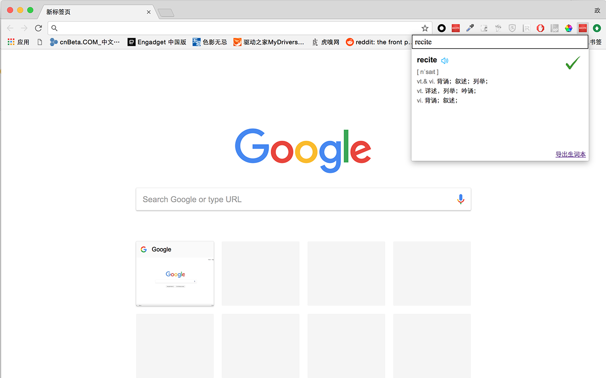
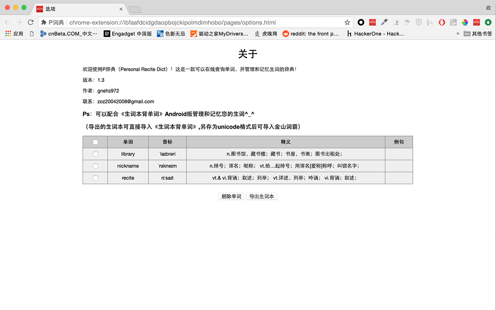

# PReciteDict  
A Chrome extension to query word from online dict quickly while working or studying.  
The query result include a concise explain, the pronunciation, and it can be saved and exported as txt in the format of ciba.

The dict API is provided by
[iciba open platform](https://open.iciba.com/index.php?c=wiki&t=cc),
#### Overview
Pls try it in chrome web store [P词典](https://chrome.google.com/webstore/detail/bchghhkcoamecpkkkdbkfjgcdfjcnmka?authuser=0&hl=en)
 

#### Tech
- Chrome extension
- Typescript
- Webpack
- Npm
- Dexie
#### Run in local
1. Run `npm run build`
2. Open Chrome extension page [chrome://extensions](chrome://extensions)
3. Enable Developer Mode 
4. Click the Load unpacked button and select the project root directory